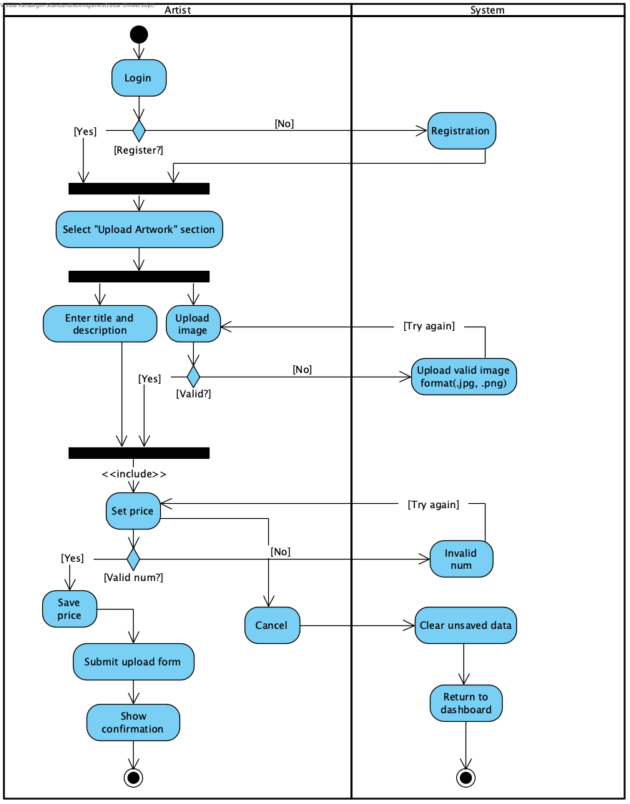
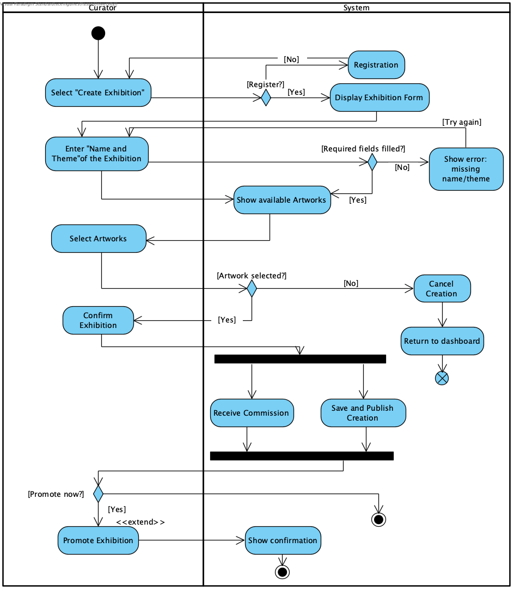
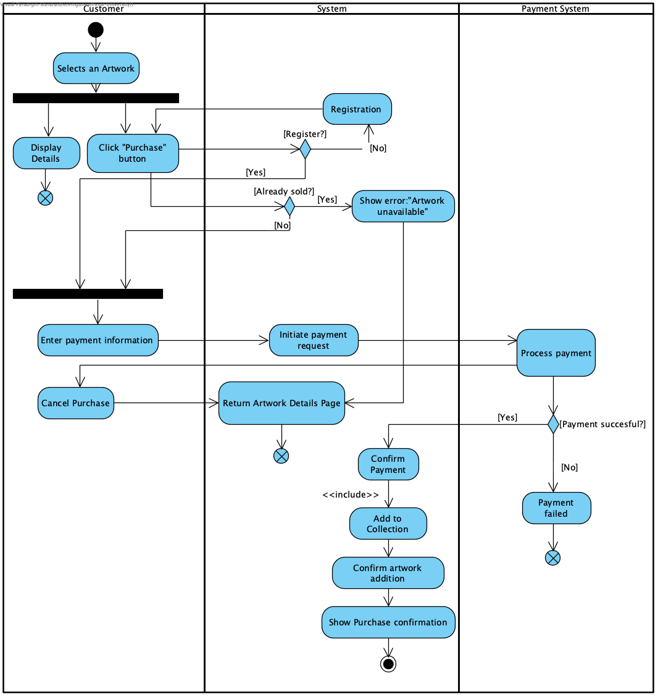
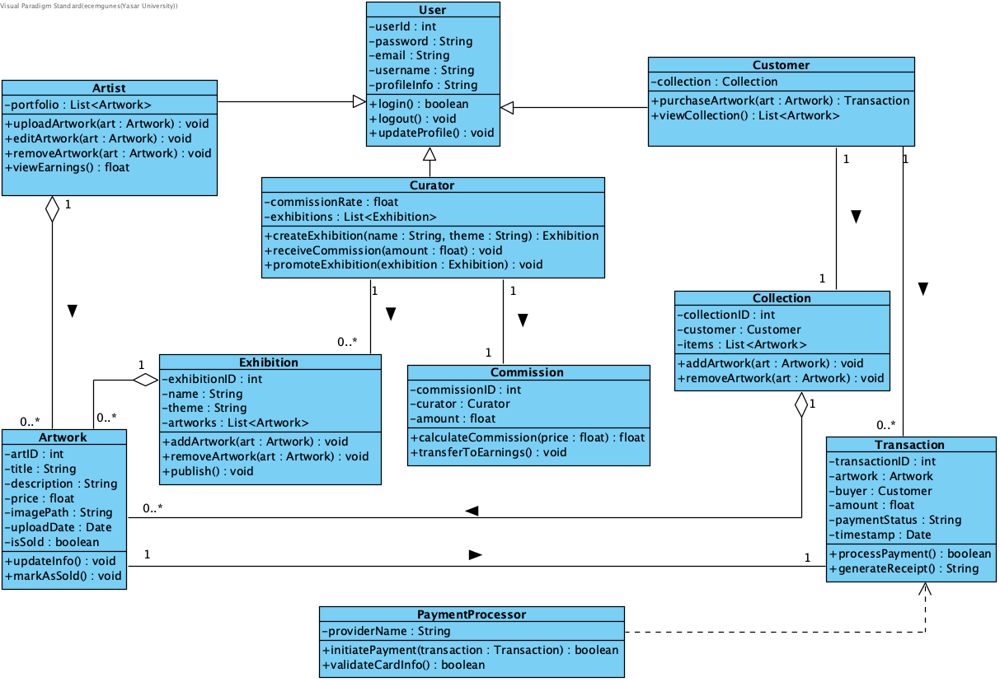

# 🎨 ARTSYS — Online Art Exhibition System

> **Yaşar University — System Analysis & Design Project**  
> **Author:** Ecem Güneş  
> **Tool:** Visual Paradigm  

---

## 📌 Overview

**ARTSYS** is a desktop-based Online Art Exhibition System designed to bridge the gap between artists and art-lovers by providing a digital platform for showcasing, curating, and purchasing artworks.

Traditional galleries are limited by space, cost, and geography — especially for emerging artists. ARTSYS provides a structured, interactive, and accessible alternative where:

- 🎨 **Artists** can upload and sell their work
- 🖼️ **Curators** can organize thematic exhibitions and earn commissions
- 🛒 **Customers** can browse, purchase, and collect artworks

---

## 👥 User Roles

| Role | Capabilities |
|---|---|
| **Artist** | Create account, upload artworks (title, description, price, image), manage portfolio |
| **Curator** | Create and manage exhibitions, select artworks by theme, earn 1% commission per artwork |
| **Customer** | Register, browse exhibitions, view artwork details, purchase and collect artworks |

---

## 🗂️ Project Structure

```
ARTSYS/
├── 📄 README.md
├── 📄 ARTSYS_Report.pdf           # Full system analysis & design report
└── 📁 diagrams/
    ├── 📁 use-case/
    │   └── use_case_diagram.png
    ├── 📁 activity/
    │   ├── activity_upload_artwork.png
    │   ├── activity_create_exhibition.png
    │   └── activity_purchase_artwork.png
    ├── 📁 class/
    │   └── class_diagram.png
    └── 📁 sequence/
        ├── sequence_upload_artwork.png
        ├── sequence_create_exhibition.png
        └── sequence_purchase_artwork.png
```

---

## 📊 UML Diagrams

### Use Case Diagram
> Shows interactions between Artists, Curators, and Customers with the system.


---

### Activity Diagrams

**Upload Artwork** — Artist login → enter details → validate image → set price → submit



**Create Exhibition** — Curator login → enter name/theme → select artworks → receive commission → optionally promote



**Purchase Artwork** — Customer selects artwork → payment processing → add to collection



---

### Design Class Diagram
> Shows all system classes, attributes, methods, and relationships (inheritance, association, composition).

Key classes: `User`, `Artist`, `Curator`, `Customer`, `Artwork`, `Exhibition`, `Transaction`, `Commission`, `Collection`, `PaymentProcessor`



---

### Sequence Diagrams

**Upload Artwork** — Interaction between Artist, UploadForm, UploadController, Validator, and Artwork objects


**Create Exhibition** — Interaction between Curator, ExhibitionForm, ExhibitionController, Commission, and PromotionService


**Purchase Artwork** — Interaction between Customer, System, Artwork, Transaction, PaymentProcessor, and Collection


---

## 🖥️ Application Screenshots

### Login Page
Clean entry point for all user roles (Artist, Curator, Customer) with email, password, and role selection.

### Upload Artwork
Artists can enter title, description, category, price and upload an image. Validation is handled before submission.

### Browse & Purchase
Customers can browse artworks by category, view details, and purchase directly. Purchased items are added to their personal collection.

### Create Exhibition
Curators can create thematic exhibitions by selecting available artworks. A 1% commission is automatically calculated and transferred upon creation.

---

## 💾 Data Storage

| Data Type | Storage |
|---|---|
| User accounts | Database (username, password, email, profile info) |
| Artworks | Database (title, description, price, upload date) + Cloud (images) |
| Exhibitions | Database (name, theme, participating artists) |
| Transactions | Database (purchase details, order status, payment info) |

---

## 🛠️ Technology

- **Platform:** Desktop Application
- **GUI Framework:** PyQt5
- **Modeling Tool:** Visual Paradigm
- **Architecture:** Object-Oriented Design with inheritance and polymorphism

---

*Yaşar University — Engineering Faculty, Computer Engineering Program*
